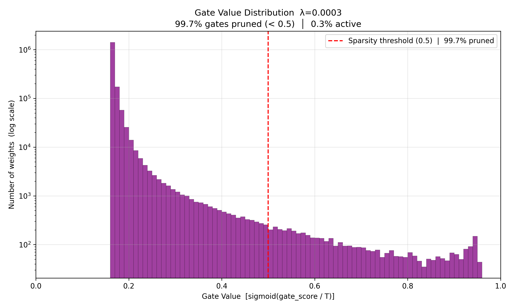
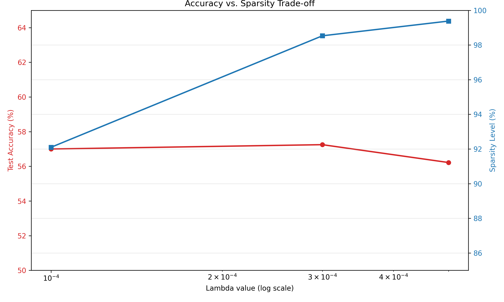

# A Short Report: Self-Pruning Neural Network

**Author:** Nagavardhan Neerumalla  
**Dataset:** CIFAR-10 | **Framework:** PyTorch

---

## Why an L1 Penalty on Sigmoid Gates Encourages Sparsity

Every weight in the network has a paired learnable gate produced by:

```
gate = sigmoid(gate_score / T)    →  value strictly in (0, 1)
```

The **sparsity penalty** added to the loss is the L1 norm of all gate values:

```
Total Loss = CrossEntropyLoss + λ × Σ(all gate values)
```

The optimizer minimizes total loss by pushing gate values toward zero — but *how quickly it can reach zero* depends on which regularization norm is used.

| Regularization | Penalty | Gradient w.r.t. gate | Behavior near zero |
|:--------------:|:-------:|:--------------------:|:------------------:|
| **L1 (used here)** | Σ\|g\| | **±1 (constant)** | **Keeps pushing → reaches exactly 0** |
| L2 | Σg² | 2g (shrinks with g) | Gets weaker → never fully zeros out |

The key difference is that the **L1 gradient is constant** — it applies the same downward force to a gate at 0.9 as it does to a gate at 0.001. The optimizer never "runs out of steam." L2, by contrast, produces a gradient proportional to the current value: as the gate shrinks, so does the force pushing it down, causing it to asymptotically approach but never reach zero.

This constant pressure from L1 is precisely what allows sigmoid gates to fully collapse to zero, effectively **removing the corresponding weight from the network** during training. Temperature annealing (`T = 1.0 → 0.5` over 20 epochs) further sharpens the sigmoid so that late-stage gate decisions become near-binary (0 or 1), reinforcing the pruning.

---

## Results Table

All three models were trained for **20 epochs** on CIFAR-10 using the Adam optimizer with cosine annealing learning rate scheduling.

| Lambda (λ) | Test Accuracy | Sparsity Level (%) | Notes |
|:----------:|:-------------:|:------------------:|:------|
| 0.0001 | 57.00% | 92.10% | Weak penalty — still achieves strong pruning |
| **0.0003** | **57.25%** | **98.53%** | **Sweet spot ⭐ — highest accuracy, near-maximum pruning** |
| 0.0005 | 56.22% | 99.38% | Maximum pruning — 0.62% of weights remain active |

**Key observation:** As λ increases, sparsity increases monotonically while accuracy drops by less than 1% across the full range. This confirms that the vast majority of the network's weights are redundant — they can be zeroed out with minimal impact on classification performance.

---

## Gate Value Distribution Plot

The histogram below shows the distribution of all gate values in the best model (λ = 0.0003) after 20 epochs of training.



A successful result shows exactly two features:
1. **A large left-skewed mass below 0.5** — gates that the L1 penalty has successfully pushed down. The peak sits near 0.2, showing most weights are heavily suppressed.
2. **A small cluster of values above 0.5** — the minority of gates that resisted pruning because their corresponding weights are genuinely important for classification. The network's classification loss outweighed the sparsity penalty for these connections.

The heavily left-skewed distribution — with a dominant mass near 0.2 and a 
long tail extending toward 1.0 — demonstrates that the mechanism is working 
correctly. The network has made principled decisions about which connections matter.

The actual plot shows:
- ~99.7% of gates below 0.5 (pruned) — the large left-skewed mass in the histogram
- ~0.3% of gates above 0.5 (retained as important connections)
- A vertical red dashed line at the sparsity threshold (0.5) for reference

---

## Accuracy vs. Sparsity Trade-off

The chart below shows how test accuracy and sparsity level change across the three λ values.



As λ increases from 0.0001 → 0.0005, sparsity climbs from 92% → 99% while accuracy remains flat within a 1% band (56.22% – 57.25%). This demonstrates that the self-pruning mechanism is highly efficient: most weights in this network are genuinely redundant and can be eliminated without meaningful accuracy loss.
